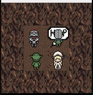

# so_long

A 2D game project developed for the 42 School, using the MiniLibX library.

## Overview

The so_long project is a simple 2D game where the player must navigate through a map, collect items, and reach the exit while avoiding enemies. The game was developed as part of the 42 School curriculum, with the objective of understanding basic game mechanics and graphical rendering using the MiniLibX library.

## Example Gameplay

### Stand Animation


The character's idle animation when not moving.

### Kill Goblin Animation


An animation showing the action of killing a goblin.

### Lose Animation


An animation that plays when the player loses the game.

### Victory Animation


An animation that plays when the player wins the game.

### Animation Scale (Small)



The character's idle animation when not moving, shown in a small scale.

### Animation Scale (Big)


The character's idle animation when not moving, shown in a large scale.

## Features

- **2D Game Rendering** using MiniLibX
- **Player Movement** across a grid-based map
- **Collectible Items** that must be gathered before exiting
- **Enemies** that the player must avoid
- **Customizable Maps** created using simple text files

## Additional Features Implemented

- **Transparency in Images:** A specific color is used to create transparent areas in the sprites.
- **Pixel-by-Pixel Rendering:** Images are loaded pixel by pixel and displayed using mlx_put_to_window.
- **Player Animation:** The player character features animated movement.
- **Exit Animation:** The exit features an animation with an emoji balloon.
- **Animated Collectables:** Items that can be collected have animations.
- **Collectable Death:** Collectables disappear or "die" once collected.
- **Random Collectable** Movement: Collectables move randomly across the map.
- **Enemy Animation:** Enemies feature animations during movement.
- **Random Enemy Movement:** Enemies move randomly throughout the game environment.
- **60 FPS Rendering:** The game's rendering is capped at 60 frames per second to ensure smooth gameplay.
- **Combat Screen:** A combat screen with selectable options is included.
- **Adjustable Combat Screen Size:** The combat screen can be resized to fit different resolutions.
- **Victory and Defeat Animations:** Both victory and defeat conditions trigger their own unique animations.

## Installation

1. Clone the repository:

    ```sh
    git clone https://github.com/Alabar666/so_long.git
    ```

2. Navigate to the project directory:

    ```sh
    cd so_long
    ```

3. Compile the game:

    ```sh
    make
    ```

4. Run the game with a map file:

    ```sh
    ./so_long maps/sample_map.ber
    ```

## How to Play

- Use the arrow keys to move the character.
- Collect all the items (`C`) on the map.
- Avoid the enemies (`M`) and reach the exit (`E`).

## Map Format

Maps are simple `.ber` files that represent the game grid. Each character in the file corresponds to a different element:

- `1` - Wall
- `0` - Empty Space
- `P` - Player Start Position
- `C` - Collectible Item
- `E` - Exit
- `M` - Enemy

## Contributing

Contributions are welcome! Feel free to submit a pull request or open an issue.

## Special Thanks

A special thanks to **Kahon Senpai** for the amazing sprites used in the game. 
Your artwork greatly enhanced the visual appeal and overall experience of the project. 
I appreciate your creativity and dedication to the gaming community.
https://kahonsenpai.itch.io/non-commercial-goblin-slayer
